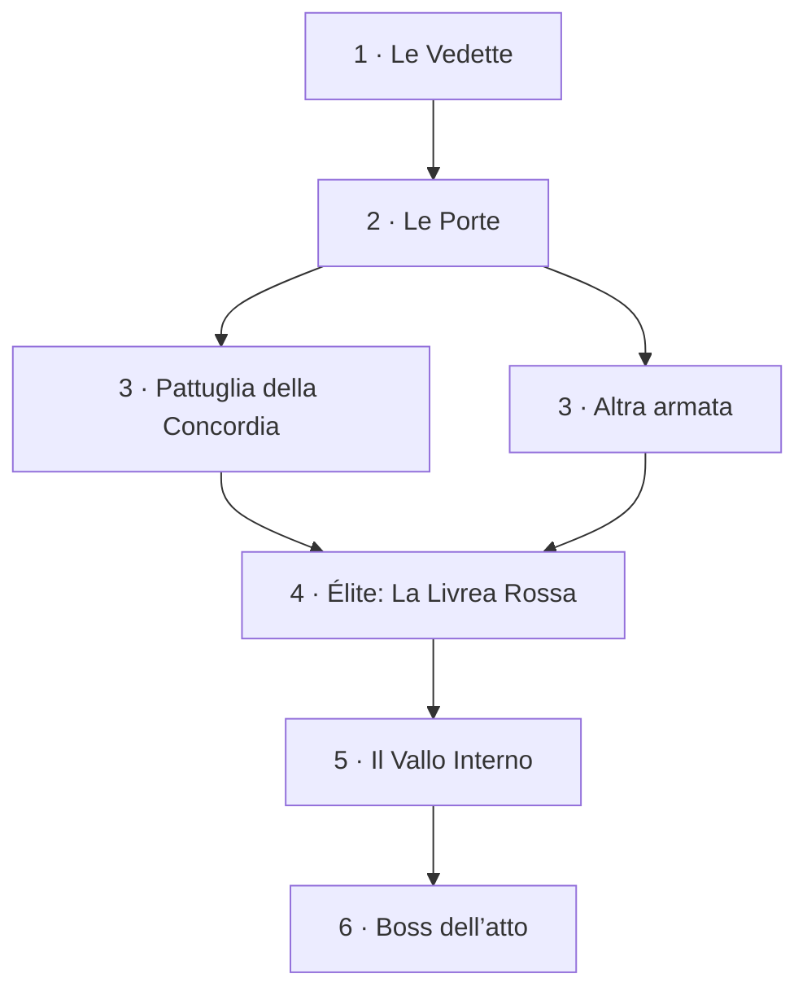
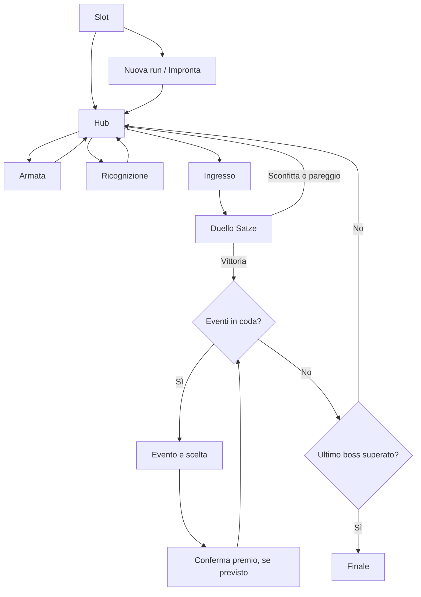

# SATZE — Design base della campagna

**Versione 0.2 · 8 settembre 2026**  
**Protagonista:** il Nascente · **Antagonista principale:** Concordia di Caelion  
**Ambito:** campagna controllata in tre atti, collegata al duello di produzione e alle Eminenze.

Questo documento descrive la base implementata e i criteri per estenderla. Le sezioni «Da sviluppare» indicano contenuti futuri: non sono funzionalità già disponibili. Il riferimento operativo del modello è [CAMPAGNA_CONCORDIA.md](CAMPAGNA_CONCORDIA.md).

## 1. Esperienza desiderata

Il giocatore accompagna il Nascente attraverso un territorio ostile, sceglie una via, affronta un’armata e modifica progressivamente il proprio mazzo. Il ritmo alterna osservazione, decisione, duello e conseguenza. Ogni schermata deve rendere evidenti tre cose: dove siamo, quale scelta possiamo compiere e cosa cambia dopo averla compiuta.

Il riferimento a Inscryption riguarda la progressione a incontri, il peso delle carte e la messa in scena delle decisioni. Le regole dello scontro rimangono quelle di Satze. I tre atti condividono il sistema di combattimento; non introducono tre giochi diversi.

Principi:

- **Percorso leggibile:** gli incontri futuri sono visibili, quelli disponibili sono riconoscibili; l’avanzamento segue tappe definite.
- **Identità persistente:** il Nascente resta il protagonista, compare nell’hub ed è sempre nella mano iniziale.
- **Scelte concrete:** il bivio cambia l’avversario; una ricompensa modifica il Nascente o aggiunge una carta alla riserva.
- **Atmosfera coerente:** fondali di Satze, verde scuro, oro consumato e accenti cosmici; cornici e carte del gioco esistente.
- **Movimento informativo:** selezione, ingresso e acquisizione hanno un riscontro visivo; testi, bersagli e comandi restano stabili.

## 2. Struttura dei tre atti

| Atto | Titolo | Funzione nel percorso | Fondale attuale | Boss |
|---|---|---|---|---|
| I | Oltre il Vallo | Presentare la resistenza della Concordia e il primo sviluppo dell’armata | `campo-54.webp` | La Corona Vuota |
| II | Le Livree del Vespro | Combinare minacce più forti e continuare la crescita del Nascente | `campo-51.webp` | L’Ultima Sortita |
| III | Il Primo Sole | Portare il mazzo costruito alla difesa finale | `campo-53.webp` | Il Custode del Primo Sole |

Ogni atto contiene **sei incontri da vincere lungo il percorso scelto**. La terza tappa presenta due alternative: si gioca solo quella selezionata. Sulla mappa sono quindi visibili sette nodi, ma la progressione dell’atto conta sei tappe. In totale servono diciotto vittorie, esclusi i tentativi falliti.

Le alternative speciali attuali sono Corte Rossa, Ratti della Megera e Kethran, rispettivamente nei tre atti. Sono incontri laterali: l’antagonista della campagna resta la Concordia, fazione creata per questa modalità.

La difficoltà cresce attraverso mazzi e profili IA configurati. I primi due incontri dell’Atto I sono facili; gli altri incontri ordinari usano il profilo medio; élite e boss quello difficile. Gli incontri speciali ereditano attualmente il profilo della terza tappa. Il bilanciamento resta da verificare con partite reali.

## 3. Layout dell’hub

La scena occupa lo spazio disponibile e scorre quando il contenuto supera l’altezza della finestra. Il fondale appartiene all’atto corrente; nebbia e particelle danno profondità, con una velatura che mantiene leggibili i contenuti.

| Zona | Posizione e dimensione indicativa | Contenuto | Interazione |
|---|---|---|---|
| Barra superiore | Bordo alto, orizzontale | Identità della campagna; Percorso; Armata e Nascente; Editor eventi; Animazioni; Menu | Navigazione e preferenza del movimento |
| Intestazione dell’atto | Sotto la barra | Titolo grande, atto e incontro corrente; tre sigilli degli atti | I sigilli indicano progresso, non permettono salti |
| Mappa | Area centrale sinistra, flessibile | Sentieri, sette nodi, bivio, destinazione selezionata, marcatori degli eventi | Selezionare una delle alternative disponibili |
| Pannello incontro | Colonna destra di circa 326 px, 385 px nelle finestre grandi | Illustrazione, tipo, fazione, titolo, briefing, risorse, Eminenza, eventi attesi | Esaminare l’armata; affrontare l’incontro |
| Fascia del gruppo | Sotto mappa e incontro | Ritratto evolutivo, POT/DAN/Lega del Nascente; ventaglio dell’armata e riserva | Aprire la gestione delle carte |
| Avvisi | Tra intestazione e contenuto | Errore di salvataggio o recupero di un incontro interrotto | Correggere il problema o tornare alla mappa |

La mappa usa coordinate relative, con un percorso ascendente da sinistra a destra. I sentieri raggiungono il centro dei medaglioni indipendentemente dalla lunghezza dei titoli. Il ramo speciale corre più in basso e si ricongiunge all’élite. L’icona a stella accanto a un nodo indica che è configurato almeno un evento dopo la vittoria.

### Stati dei nodi

| Stato | Aspetto | Comportamento |
|---|---|---|
| Futuro | Medaglione freddo, senza luce attiva | Visibile e disabilitato |
| Disponibile | Bordo oro e luce | Selezionabile, ma il clic non avvia lo scontro |
| Selezionato | Anello pulsante, indicatore della destinazione e sentiero in movimento quando esiste un tratto precedente | Aggiorna il pannello incontro |
| Superato | Spunta e colore verde tenue | Non rigiocabile da questa mappa |
| Ramo non scelto | Non viene marcato come vinto | Non più disponibile dopo il superamento della tappa |

L’icona distingue battaglia, élite, speciale e boss. Lo stato è descritto anche nelle etichette accessibili: il colore non è l’unico segnale.

### Adattamento alla finestra

Sotto 1100 px i sigilli degli atti diventano compatti. Sotto 760 px la mappa e il pannello incontro si dispongono in verticale; il pannello conserva illustrazione e testo affiancati finché lo spazio lo consente. Sotto 420 px anche questi elementi si impilano. Le carte conservano le proporzioni del componente di produzione; le griglie riducono il numero di colonne. Queste soglie descrivono il CSS attuale e richiedono una verifica visiva nelle dimensioni effettive della finestra di gioco.

## 4. Schermate e stati

### 4.1 Salvataggi

Tre slot indipendenti mostrano la progressione salvata. Da uno slot vuoto si entra nella creazione; da uno occupato si riprende la run. La cancellazione richiede una conferma esplicita. L’editor della distribuzione degli eventi è accessibile anche da qui. Il modello legacy mantiene la propria interfaccia.

### 4.2 Creazione del Nascente

Ritratto ampio a sinistra; introduzione, tre Impronte e comando «Inizia il cammino» a destra. Il Nascente parte con **3 POT, 2 DAN e Lega 2**, insieme a nove Figli dell’Orizzonte.

| Impronta | Effetto iniziale |
|---|---|
| Istinto del primo colpo | Turbo: +1 POT |
| Arte dell’agguato | Imboscata: 1 danno diretto |
| Memoria del torto | Vendetta: +1 FC |

Selezionare un’Impronta ne evidenzia sigillo e cornice. La run nasce e viene salvata solo con il comando di avvio. Un errore di salvataggio lascia il giocatore nella schermata con un messaggio leggibile.

### 4.3 Mappa e preparazione

L’hub seleziona inizialmente il primo incontro della tappa corrente. Al bivio il giocatore può cambiare destinazione prima di iniziare. Il pannello mostra i dati dell’incontro scelto, non una descrizione generica dell’atto. Eventi ancora da risolvere, un tentativo già attivo o Lega oltre 30 impediscono un nuovo scontro.

### 4.4 Ricognizione

«Esamina l’armata» apre una finestra sopra la mappa. Mostra le dieci carte del mazzo nemico, il nome e lo Statico dell’Eminenza e l’eventuale carta firma garantita del boss. Le carte riusano `CardReworkP4Scaled`. Le carte Concordia senza arte individuale usano ancora i fallback esistenti.

La finestra cattura il focus, si chiude con Chiudi, Escape o clic sullo sfondo e restituisce il focus al comando di apertura. Non si tratta di una scelta nel combattimento: non consuma risorse.

### 4.5 Ingresso nell’incontro

«Affronta l’incontro» registra il tentativo e mostra per circa **650 ms** illustrazione, sigillo e titolo della destinazione. «Entra subito» salta la presentazione. Con animazioni disattivate o movimento ridotto di sistema si procede senza attesa intenzionale.

Il timer e il comando manuale condividono una protezione: il duello deve partire una sola volta. L’avvio passa al flusso di produzione; se fallisce, il tentativo viene liberato e il giocatore può riprovare dalla mappa. Chiudere il gioco durante l’ingresso lascia un tentativo recuperabile, non una vittoria.

### 4.6 Duello ed esito

La campagna avvia il vero duello di Satze, con campi, mano, risorse e sistema delle Eminenze esistenti. Il layout dello scontro è definito in `Codice/satze.jsx`: la campagna non ne introduce una versione alternativa.

Dopo una vittoria si registra l’esito, si avanza e si accodano gli eventi previsti per quell’incontro. Sconfitta e pareggio consentono di ritentare la stessa tappa. I callback ripetuti o relativi a un vecchio tentativo non devono assegnare vittorie o premi aggiuntivi.

### 4.7 Evento

L’evento occupa il centro dell’hub: ritratto del Nascente, titolo, testo e da una a quattro scelte. Il premio mostra la carta reale; per una crescita si vede il Nascente risultante. La Lega dell’armata dopo la scelta è visibile prima di confermare. Il testo resta interamente disponibile, senza effetto macchina da scrivere obbligatorio.

Gli eventi si risolvono nell’ordine configurato. Nella configurazione base ci sono reclutamento dopo la seconda battaglia, crescita dopo l’élite e alleato dopo l’incontro speciale. Gli eventi del ramo non giocato non si attivano. Le quantità non sono quote casuali: l’editor ne controlla le destinazioni.

### 4.8 Acquisizione

Una scelta con ricompensa apre una conferma con la carta in primo piano, un ingresso breve e un alone. La carta è già stata assegnata e salvata: «Continua il cammino», Chiudi o Escape chiudono la presentazione. Ricaricare durante questa schermata non assegna il premio due volte e non lo perde. Una scelta senza modifiche torna direttamente al flusso successivo.

La conferma è una presentazione temporanea, non un nuovo stato persistente della run. I limiti delle statistiche e il possesso di una carta continuano a essere gestiti dal modello; il premio non può oltrepassarli.

### 4.9 Armata e Nascente

Una griglia mostra tutte le carte possedute. La selezione è una bozza finché non viene premuto «Salva armata». Contatore delle carte e Lega si aggiornano mentre si cambia la selezione. Il Nascente è obbligatorio e non può essere deselezionato. Un salvataggio valido torna alla mappa; uno non valido lascia la bozza e mostra l’errore.

Cambiare scheda senza salvare non modifica l’armata persistente. Le ricompense entrano in riserva: non sostituiscono automaticamente una carta del mazzo. La modifica è bloccata mentre un incontro risulta attivo.

### 4.10 Finale e recupero

Dopo il boss dell’Atto III e gli eventuali eventi ancora in coda appare «Le campane tacciono», con il Nascente nella forma raggiunta e il ritorno al menu. Non viene creato un quarto atto.

Se è presente un tentativo interrotto, l’hub propone «Riprendi dalla mappa». Questo comando libera il tentativo e permette di ricominciare lo stesso incontro; non ripristina un duello a metà e non modifica la progressione delle vittorie.

### 4.11 Editor eventi

È uno strumento di authoring separato dalla scena. Permette di creare e modificare eventi, assegnarli a incontri dei tre atti, riordinarli, definire testo e ricompense, importare ed esportare JSON. La validazione controlla identificatori, destinazioni, carte, tipi di premio e numero delle scelte.

«Salva distribuzione» modifica il modello locale usato dalle **nuove run**. Ogni run conserva una copia della definizione iniziale, quindi una partita esistente non cambia dopo una modifica dell’editor. Per distribuire un nuovo modello insieme al gioco occorre aggiornare i dati nel repository.

## 5. Flusso di navigazione

Il passaggio di atto aggiorna titolo, fondale, incontri e mazzi. Eventuali eventi del boss appena sconfitto vengono risolti prima di affrontare la nuova tappa. Non si deve dedurre la progressione dalla durata delle animazioni o dall’elemento selezionato nella UI.

## 6. Regole del modello

| Area | Regola attuale |
|---|---|
| Mazzo | Dieci carte distinte possedute; Nascente incluso; Lega totale massima 30 |
| Identità dell’armata | Almeno cinque Figli dell’Orizzonte contando il Nascente, per l’Eminenza |
| Mano | Cinque carte; Nascente garantito; carta firma del boss garantita quando configurata |
| Risorse di incontro | 25 PV e 18 FC; cinque campi; Presenza dell’Eminenza al valore iniziale |
| Continuità | Mazzo, riserva, crescita, progressione ed eventi persistono; PV, FC e Presenza ripartono fra gli incontri |
| Randomizzazione | Le mani della campagna sono riproducibili per seed e incontro; i campi seguono la selezione del gioco esistente |
| Avanzamento | Una vittoria supera una tappa; il bivio ne consuma una sola |
| Fallimento | Sconfitta e pareggio non fanno avanzare e non assegnano premi |
| Ricompense | Carta in riserva; crescita POT, DAN o Impronta; oppure nessuna modifica |
| Crescita | Si applicano i cap del Nascente; Lega e stadio visivo sono derivati dalle statistiche e dall’abilità |
| Lega oltre 30 | Una crescita può richiedere di riorganizzare il mazzo prima di poter avviare un altro incontro |
| Sicurezza del risultato | ID del nodo e numero del tentativo associano l’esito all’incontro corretto |

La Concordia dispone di quindici carte esclusive della campagna e cinque mazzi configurati. L’Eminenza **Le Campane del Vallo** parte da 1 Presenza e valorizza la risposta per seconda. Le attive sono Serrate le porte (+1), Alla seconda campana (−2) e Sortita del Vallo (−4). I testi e gli effetti completi rimangono nei dati dell’Eminenza; questa scheda di design non li duplica come seconda fonte di regole.

## 7. Direzione del movimento e dell’audio

| Elemento | Comportamento implementato | Scopo |
|---|---|---|
| Fondale | Parallasse solo con mouse, massimo circa ±9 px orizzontali e ±6 px verticali | Profondità senza spostare comandi e testo |
| Atmosfera | Nebbia lenta e 16 particelle con traiettorie deterministiche | Dare vita al territorio senza influire sul seed di gioco |
| Percorso | Indicatore della destinazione in movimento per circa 550 ms; tratto in avvicinamento luminoso | Rendere leggibile il cambio di scelta |
| Pannello incontro | Ingresso breve laterale di circa 350 ms | Confermare il cambio di avversario |
| Carte e scelte | Entrata progressiva di 400 ms con intervalli di 35 ms, limitati | Dare peso alla comparsa delle carte |
| Ricompensa | Ingresso della carta di circa 650 ms; conferma chiudibile subito | Rendere evidente ciò che si è ottenuto |
| Partenza | Presentazione di 650 ms, saltabile | Collegare la mappa al duello |
| Suoni | Selezione e conferma tramite il bus audio esistente | Risposta coerente con le opzioni sonore del gioco |

Il pulsante **Animazioni: sì/no** conserva la preferenza localmente. Il movimento ridotto di sistema ha priorità; le animazioni si fermano anche quando la pagina è nascosta. Il movimento del mouse aggiorna proprietà CSS tramite un solo frame programmato e non provoca un render React per ogni evento. Nessuna informazione importante viene comunicata soltanto con un movimento o un suono.

## 8. Riferimenti di implementazione

| Responsabilità | File principale |
|---|---|
| Hub e azioni del giocatore | `src/components/campaign/ControlledCampaignHub.jsx` |
| Mappa, fondali, sigilli | `src/components/campaign/CampaignScenery.jsx` |
| Preferenza movimento e parallasse | `src/components/campaign/CampaignScene.jsx` |
| Presentazione di ingresso | `src/components/campaign/CampaignDeparture.jsx` |
| Finestra con gestione del focus | `src/components/campaign/CampaignDialog.jsx` |
| Creazione e slot | `src/components/campaign/CampaignSaveSlots.jsx` |
| Editor | `src/components/campaign/CampaignEventEditor.jsx` |
| Aspetto e animazioni | `src/styles/campaign/campaign-scene.css` |
| Struttura degli atti | `src/campaign/data/controlledCampaign.js` |
| Stato, transizioni, ricompense | `src/campaign/state/controlledCampaignState.js` |
| Persistenza e compatibilità | `src/campaign/state/persistence.js` |
| Validazione della definizione | `src/campaign/logic/campaignDefinition.js` |
| Collegamento al duello | `src/campaign/logic/missionAdapter.js` |
| Regole e arte evolutiva del Nascente | `src/campaign/logic/nascente.js`, `src/data/images.js` |

La scelta evidenziata, la finestra aperta, la bozza del mazzo e le presentazioni sono stato dell’interfaccia. La run è la fonte di verità per ciò che è stato vinto, ottenuto e salvato. L’illustrazione di fazione è `public/campaign/concordia-vallo.webp`; i suoi riferimenti di generazione sono nel documento operativo.

## 9. Criteri di accettazione

- Una nuova run parte da una delle tre Impronte e si ritrova nello slot scelto.
- In ogni tappa si possono selezionare soltanto gli incontri disponibili; il ramo non scelto non viene registrato come vinto.
- Ricognizione, Nascente e ricompense usano i componenti e i dati delle carte reali.
- Saltare la presentazione e far scadere il timer non può avviare due duelli.
- Un errore di avvio restituisce un incontro ritentabile.
- La scelta di un evento assegna e salva il premio una sola volta; chiudere la conferma non lo annulla.
- Un mazzo non valido non viene salvato e non consente l’avvio del duello.
- Le finestre sono utilizzabili da tastiera; i movimenti possono essere disattivati.
- L’editor non modifica retroattivamente la definizione di una run già iniziata.
- La nuova presentazione non altera il layout o la risoluzione del duello di produzione.

Build e test DOM verificano compilazione e interazioni. Non sostituiscono il controllo visivo: l’anteprima locale nell’ambiente di lavoro è stata bloccata con `ERR_BLOCKED_BY_CLIENT`. Da verificare nel gioco: leggibilità a diverse risoluzioni, sovrapposizioni dei nodi, ritmo percepito, volume dei suoni e comfort del movimento.

## 10. Da sviluppare

Priorità successive: illustrazioni individuali delle quindici carte Concordia; maggiore varietà visiva dei luoghi e dei boss; testi specifici per gli incontri; bilanciamento dell’IA e delle ricompense attraverso playtest. Le durate delle animazioni sono una base regolabile dopo queste prove.

Artefatti e magie restano rimandati. Non sono previsti in questa versione un inventario di artefatti, un negozio, una valuta persistente, una campagna generata liberamente o nuovi comandi magici nel duello. Un’eventuale estensione dovrà definire prima acquisizione, consumo, limiti, salvataggio e interazione con il motore esistente.
