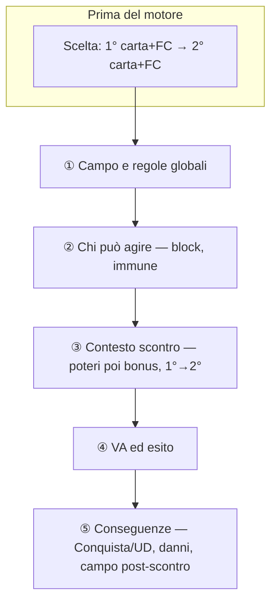
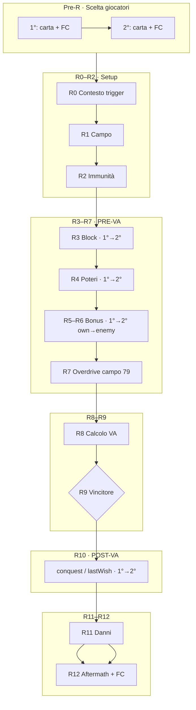
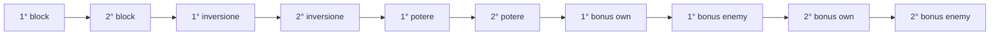

# SATZE — Schema completo fasi duello e timing

Documentazione di riferimento per **fasi**, **finestre trigger** e **ordine di risoluzione** di uno scontro.

**Fonte di verità del motore:** `src/game/duelResolve.js` → `computeDuelResolution()`.

Documento correlato (appendice tecnica estesa): [DUELLO_FASI.md](DUELLO_FASI.md).

---

## Come leggere una carta o un bonus

Tre domande, in ordine:

1. **In quale blocco** entra in gioco? (sorgente: potere vs bonus armata vs campo)
2. **Il trigger** è soddisfatto? (condizione: Imboscata, Overdrive, Conquista…)
3. **L'effetto** ha impatto reale in quel blocco? (POT/VA sì in contesto; debuff nemico no dopo l'esito)

| Ruolo | Cosa decide |
|-------|-------------|
| **Sorgente** | Potere carta, bonus armata (2+ carte) o regola campo |
| **Trigger** | *Se* scatta — non *quando* nel motore, ma *in quale blocco* (contesto vs conseguenze) |
| **Effetto** | *Cosa* cambia — e se vale qualcosa lì |

**Regola esplicita:** il **bonus armata** risolve **dopo** i poteri carta, nello stesso blocco "contesto scontro". È una scelta di design (premio deckbuilding), non un effetto nascosto.

---

## Vista logica — I cinque blocchi



| Blocco | Cosa succede | Timing trigger |
|--------|--------------|----------------|
| **Scelta** | Ogni giocatore sceglie carta + FC | Nessun effetto carta ancora |
| **① Campo** | Modificatori stat, cap FC/DAN, trigger forzati dal campo | Setup, non trigger carta |
| **② Block/Immune** | Blocca Potere, Blocca Bonus, Immune | Pre-risoluzione, 1°→2° |
| **③ Contesto** | Poteri carta → Bonus armata → mod. campo tardivi | **Tutti i trigger pre-esito** |
| **④ VA** | `VA = POT × FC + mod VA` → vincitore | Nessun nuovo trigger carta |
| **⑤ Conseguenze** | Conquista/UD, danni, aftermath campo, −FC | **Solo Conquista e Ultimo Desiderio** |

### ① Campo e regole globali

Effetti del **campo di battaglia** che definiscono il terreno di gioco: modifiche stat in scontro, limiti (poteri off, FC max, DAN max), trigger forzati sempre attivi.

Catalogo: [CAMPI_MASTER.md](CAMPI_MASTER.md).

**Regola campi che modificano valori/testo** (es. Fogna Maestra `min −1`, Nexus `DAN max 4`):

- Il campo **non sostituisce** l'effetto carta/bonus: cambia **gli stessi numeri** (minimi, cap, soglie) ovunque si applichino.
- Vale per **setup campo**, **Poteri**, **Bonus** e **testo carta in duello** con la stessa regola (`minFloorReduction`, `maxDamage`, ecc.).
- Esempio Fogna: `(min 3)` su carta e nel motore diventa **min 2**; il debuff −3 POT nem. può scendere sotto il vecchio pavimento.

Campi **trigger** (Rimonta/Gloria sempre attivi, Crocevia…): regola separata — forzano la **condizione**, non i numeri.

### ② Chi può agire

**Blocca Potere / Blocca Bonus** e **Immune** si valutano prima che poteri e bonus si risolvano. Se bloccato, potere o bonus non applica effetti.

Ordine: **1° giocatore del turno → 2°** (iniziativa).

### ③ Contesto scontro

Tutto ciò che può ancora influenzare **POT, DAN, VA e HP** prima di conoscere il vincitore.

| Step | Cosa | Ordine |
|------|------|--------|
| a | **Poteri carta** (trigger pre-esito) | 1° → 2° |
| b | **Bonus armata** (se attivo: 2+ carte armata + trigger) | 1° → 2° |
| c | **Modificatori campo tardivi** al contesto (es. Camera Rituale se Overdrive) | — |

I trigger **Imboscata, Overdrive, Rimonta, Turbo…** si valutano qui. **Conquista** e **Ultimo Desiderio** (trigger carta) **no** — servono l'esito (blocco ⑤).

> Il 2° giocatore risponde al pacchetto poteri del 1°; i bonus di entrambi arrivano **dopo** tutti i poteri.

### ④ VA ed esito

```
VA = POT × FC investiti + modificatori VA
```

Vince chi ha VA più alto. Parità: Lega minore → POT minore → vince chi ha giocato per **secondo**.

Modificatori VA del campo (es. Porte di Atlantide) si applicano qui.

### ⑤ Conseguenze

Dopo che si conosce vincitore e perdente:

| Tipo | Esempi |
|------|--------|
| **Trigger carta post-esito** | Conquista, Ultimo Desiderio su potere o bonus |
| **Danni combattimento** | DAN del vincitore al perdente (cap Nexus, bonus Centrale…) |
| **Regola campo post-scontro** | Palude, Cripta +FC al perdente, Canyon −2 PV… |
| **Economia** | Sottrazione FC investiti; conquista del campo |

---

## Due finestre di timing (trigger carta)

| Finestra | Trigger | Blocco logico | Fasi motore |
|----------|---------|---------------|-------------|
| **preVa** (contesto) | Tutti tranne `conquest`, `lastWish` | ③ | R4–R7 |
| **postVa** (conseguenze) | `conquest`, `lastWish` | ⑤ | R10 |
| **sempre** | `trigger: null` | Dove applicabile | — |

**Eccezione:** campo **Crocevia dei Patti (41)** — tutti i trigger sempre attivi in preVa, inclusi Conquista/UD.

**Codice:** `src/game/triggerLogic.js` → `POST_BATTLE_TRIGGERS = ['conquest', 'lastWish']`.

---

## Fasi motore R0–R12

Mapping blocchi logici → implementazione.

| Blocco logico | Fasi motore | Handler principali |
|---------------|-------------|-------------------|
| Scelta pre-motore | — | UI / match state |
| ① Campo e regole | R0–R1 | `duelTurnContexts.js`, `duelFieldSetup.js` |
| ② Chi può agire | R2–R3 | `duelHelpers.js`, `duelBlockPrescan.js` |
| ③ Contesto scontro | R4–R7 | `duelMainAbilities.js`, `duelArmyBonusPhases.js`, `battlefieldDeepEffects.js` |
| ④ VA ed esito | R8–R9 | `duelAssaultPhase.js`, `duelWinnerResolve.js` |
| ⑤ Conseguenze | R10–R12 | `duelPostBattle.js`, `duelResolutionFinish.js`, `fieldBattleAftermath.js` |

**Ordine iniziativa:** `duelInitiativeOrder.js` → `getInitiativeSideOrder(isPlayerFirst)` in R3–R6 e R10.

### Diagramma motore (R0–R12)



### Dettaglio R3–R6 (iniziativa)



### Tabella fasi R

| Fase | Nome | Cosa succede | Handler |
|------|------|--------------|---------|
| **—** | Scelta | Carta + FC prima di `computeDuelResolution` | UI |
| **R0** | Contesto | HP, round, campi, lega, FC spesi, mano iniziale | `duelTurnContexts.js` |
| **R1** | Setup campo | Stat mod, cap FC, limiti, `fieldModifiers` | `duelFieldSetup.js` |
| **R2** | Immunità | Check `immune` pre-VA | `duelHelpers.js` |
| **R3** | Block prescan | `blockAbility` / `blockBonus` · 1°→2° | `duelBlockPrescan.js` |
| **R4** | Poteri pre-VA | Inversione, poi poteri · esclusi conquest/lastWish | `duelMainAbilities.js` |
| **R5–R6** | Bonus pre-VA | Per giocatore 1°→2°: own stat → enemy stat | `duelArmyBonusPhases.js` |
| **R7** | Overdrive campo | Camera Rituale id 79: +1 POT/DAN | `battlefieldDeepEffects.js` |
| **R8** | Calcolo VA | `POT × FC + mod`, minimo VA | `duelAssaultPhase.js` |
| **R9** | Vincitore | VA; spareggio lega → POT → 2° giocatore | `duelWinnerResolve.js` |
| **R10** | Post-VA | conquest / lastWish poteri + bonus | `duelPostBattle.js` |
| **R11** | Danni | Nexus cap, Centrale +1 DAN, DAN vincitore | `duelDamagePipeline.js` |
| **R12** | Aftermath | PV/FC post-scontro, − FC investiti | `fieldBattleAftermath.js` |

### Vocabolario interno (motore)

| Layer | ID | Uso |
|-------|-----|-----|
| **R** | R0–R12 | Fasi motore |
| **T** | `preVa` / `postVa` | Finestre trigger carta |
| **F** | timing campo CAMPI_MASTER | Regole campo, non trigger carta |

---

## Catalogo trigger carta (18 key)

**Codice:** `triggerLogic.js`, `gameMechanicsFramework.js` → `TRIGGER_KEYS`.

| Key | Nome UI | Finestra | Condizione | Override campo |
|-----|---------|----------|------------|----------------|
| `imboscata` | Imboscata | preVa | Primo a scegliere | 49; 59 swap |
| `intervention` | Intervento | preVa | Secondo a scegliere | 45; 59 swap |
| `glory` | Gloria | preVa | Vinto scontro precedente | 22 |
| `vendetta` | Vendetta | preVa | Perso scontro precedente | 22 |
| `overdrive` | Overdrive | preVa | FC ≥ soglia (5, o 4 campo 29) | 29; 79 R7 |
| `reckoning` | Resa dei conti | preVa | Entrambi ≥ 3 carte giocate | 58 |
| `rimonta` | Rimonta | preVa | PV < nemico | 39 |
| `magnanimous` | Magnanimo | preVa | PV > nemico | 31 |
| `conquest` | Conquista | postVa | Vinto questo scontro | 61 ×2; 70 Ratti |
| `lastWish` | Ultimo desiderio | postVa | Perso questo scontro | 68 ×2 |
| `opportunista` | Opportunista | preVa | Nemico ≥ 5 FC | — |
| `sfida` | Sfida | preVa | Lega < nemica | 74 |
| `sopraffare` | Sopraffare | preVa | Lega > nemica | 74 |
| `invasione` | Invasione | preVa | ≥ 1 campo conquistato | snapshot R0 |
| `resistenza` | Resistenza | preVa | Nemico ≥ 1 campo | 83 |
| `turbo` | Turbo | preVa | Round ≤ 2 | 72; 73 invert |
| `ultimaChance` | Ultima Chance | preVa | Round ≥ 5 | 73 invert |
| `alleato` | Alleato | preVa | ≥ 1 altra stessa lega in mano iniziale | 21 carte pool |
| `rinforzi` | Rinforzi | preVa | ≥ 2 altre stessa lega in mano iniziale | Patto Indocili |

---

## Bonus armata × timing

Attivo con **2+ carte** della stessa armata nella mano iniziale (**Patto degli Indocili**: basta 1 carta; l'attivazione è per-carta via Rinforzi). Risolve in blocco **③b** (R5–R6), dopo i poteri.

| Armata | Trigger | Finestra |
|--------|---------|----------|
| Figli dell'Orizzonte | sempre | preVa |
| Kethran | Rimonta | preVa |
| Corte Rossa | sempre (copia bonus) | preVa |
| Calibri Pesanti | sempre | preVa |
| Orathai | Resa dei conti | preVa |
| Mounthborn | Imboscata | preVa |
| Patto degli Indocili | Rinforzi | preVa |
| Khemet | Overdrive | preVa |
| Enclave delle Scaglie | Conquista | postVa |
| Ratti della Megera | Conquista | postVa |

Risoluzione motore: per giocatore 1°→2°, pass own stat poi enemy stat in R5–R6.

---

## Effetti × fase (validazione)

| Tipo effetto | preVa R4–R7 | postVa R10 | Dead value |
|--------------|-------------|------------|------------|
| `power`, `damage`, `assaultValue` | VA/danno corrente | stat proprie se persistono | — |
| `enemyPower`, `enemyDamage`, `enemyAssault` | Debuff corrente | **Dead** | Conquista/UD + debuff |
| `focusCoin` | Spendibile stesso round | OK se restano round | ultimaChance R5 |
| `directDamage`, `heal`, `selfDamage`, `toxin` | HP pre-esito | HP post-esito | — |
| `blockAbility`, `blockBonus` | R3 + R4 | Raro | — |
| `copyBonus` | Pre; post differiti R10 | Copia conquest/lastWish R10 | `duelCopyBonus.js` |
| `inversion` | R4, prima altri poteri | — | — |
| `immune` | R2 + R4 | — | — |

### Validazione rapida (nuove carte)

1. **Blocco** — contesto o conseguenze?
2. **Trigger** — condizione plausibile lì?
3. **Effetto** — modifica ancora qualcosa di utile? (debuff stat nemiche post-esito = dead value)
4. **Spendibilità** — FC/cure valgono nei round restanti?
5. Solo dopo: convergenza armata, bilanciamento, flavour.

Esempi:

- ❌ `Conquista: -2 POT avv.` → conseguenze, duello già chiuso.
- ⚠️ `Ultima Chance: +3 FC` a round 5 → spesso dead value.
- ✅ `Intervento: -2 POT avv.` → contesto, impatto sul VA.

Protocollo completo: [SISTEMA_BILANCIAMENTO_COMPLETO.md](Bilanciamento/SISTEMA_BILANCIAMENTO_COMPLETO.md).

---

## Campo di battaglia (layer F)

| Timing campo | Fase R | Esempi |
|--------------|--------|--------|
| `Regola` | R1 | Poteri off, FC max, trigger always-on |
| `In scontro` | R1 | ±POT/DAN, swap stat |
| `Calcolo VA` | R8 | Porte Atlantide FC×2 |
| `Conquista` (campo) | R12 | Miniera +2 PV vincitore |
| `Post-scontro` | R12 | Palude, Voragine, +FC perdente |
| `Ultimo Desiderio` (campo) | R12 | Canyon −2 PV perdente |

---

## Attenzione ai nomi

Stessa parola, cose diverse — usare sempre il contesto:

| Termine | Significato |
|---------|-------------|
| **Conquista** (trigger carta) | Potere/bonus se **vinci** lo scontro → blocco ⑤ |
| **Conquista** (regola campo) | Effetto del **campo** sul vincitore a fine scontro → blocco ⑤, layer campo |
| **Ultimo Desiderio** (trigger carta) | Potere/bonus se **perdi** → blocco ⑤ |
| **Ultimo Desiderio** (regola campo) | Es. Canyon delle Lame −2 PV al perdente → blocco ⑤, layer campo |

---

## UI vs motore (presentazione)

L'UI **mostra le monete FC prima** degli effetti, ma il motore applica poteri e bonus **prima** del marker `━━━ CALCOLO VA ━━━`.

| UI `duelPhase` | Label | Blocco motore |
|----------------|-------|---------------|
| 0 | Schieramento | Pre-R |
| 1 | Poteri e bonus | ③ R4–R7 |
| 2 | Focus coin | *(presentazione FC)* |
| 3 | Mod VA | ④ R8 |
| 4 | Scontro | ④ R9 |
| 5 | Risultato | ⑤ R10–R12 |
| 6 | Continua | Tap utente |

**Codice UI:** `src/config/duelVisualTimeline.js` → `DUEL_PHASE_META`.

---

## Riferimenti

- Regole di partita: [REGOLE_Rework.md](REGOLE_Rework.md) §3
- Bilanciamento: [SISTEMA_BILANCIAMENTO_COMPLETO.md](Bilanciamento/SISTEMA_BILANCIAMENTO_COMPLETO.md)
- Campi: [CAMPI_MASTER.md](CAMPI_MASTER.md)
- Glossario: [GLOSSARIO.md](GLOSSARIO.md)

In divergenza futura **vince il codice** e i test in `src/game/`.

---

*Ultimo aggiornamento: Luglio 2026*
